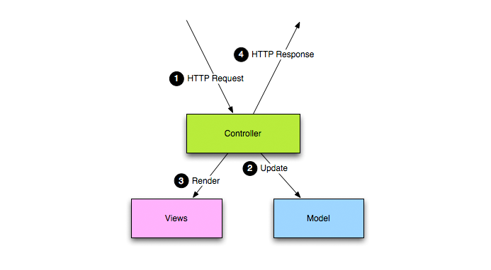

MVC应用程序模型
Play框架完全遵循MVC模式,MVC模式把应用程序分成几个独立的层：presentation表现层和model模型层，表现层进一步分成view呈现层和controller控制层。
 - **Model**层是应用程序操作的特定领域展现的信息。领域逻辑把“领域的意思”添加到原始数据里。许多应用程序使用持久存储机制，比如数据库来存储数据。MVC不特别指明数据访问层，因为mvc模型能够理解底层操作，或数据访问层已经被模型进行了封装。
 - **View**层把model层渲染到一个适当的交互窗体，如典型的用户接口。 一个model可以有多个views，以实现不同的作用。在一个web应用程序里，view通用渲染成web格式的内容，比如HTML, XML或JSON。然而，在某些情况下，view也可表示成二进制窗体，比如一个动态渲染的图表。
-  **Controller**负责响应事件 (通常是用户actions)，并对这些事件进行处理，也可能是调用model的修改方法。在一个Web应用程序里，事件特指http请求：一个专门用于监听http请求的控制器，它从’事件’里提取相关数据，比如查询字符串参数，请求headers… 并把修改结果更新到底层model对象。
 

在Play应用程序里，这三个层被分别定义到app目录下的三个java包里。
 # app/controllers
控制器就是一个java类，其中的每个public/static方法都是一个Action。一个action就是一个java入口点，当接收到一个http请求时，这个action就会被调用。控制器类里的java代码并不真正的面向对象的。Action方法从http请求中提取相关的数据，读取或更新model对象，并向http请求者返回一个封装好的response结果。
 # app/models
领域模型对象层（以下简称model）是一系列完全使用java面向对象语言特征的java类，它包含了数据结构和数据操作。无论何时，model对象都需要存储到持久化存储设备里，一般情况下他们或许还包含有一些jpa注释和sql语句。
 # app/views
通过使用play提供的高效模板系统，可以生成大多数应用程序的views。控制器从model层获得某些感兴趣的数据，然后把这些数据应用到一个模板，并且通过模板把这些数据装饰得非常漂亮。这个包由HTML, XML, JSON或其他特定用于动态生成model展现的模板文件组成。
请求生命周期
Play框架是一个完全的stateless框架，而且只面向request/response。所有的http请求都遵循以下过程：
1.一个http请求被框架接收。
2.Router组件试着找到能够接收这个请求的确切路由，相应的action方法随后被调用。
3.应用程序代码被执行。
4.如果需要生成一个复杂的view，那么一个模板文件将会被渲染。
5.acton方法的结果（http 响应代码、内容）随后被作为http response发出。

标准应用程序布局layout
应用程序布局标准化是保持开发简单化的保证。
app目录
这个目录包含了所有可执行的代码：java源代码和view模板。
我的.class文件去哪里了？ 

请不要寻找编译过的java类。框架只在运行时才编译java源代码，而且只会把编译后类文件缓存到tmp目录下。在play框架里，可执行文件是.java源文件，而不是编译后的类。
在app目录下有三个标准包，分别对应mvc架构的三个层，你也可以添加你自己的包，如utils包。
另外，views包下，还可以有以下子包：
tags, 主应用程序的标签包，比如可重用的模板片段。
每个控制器的views文件夹–按照约定，每个控制器相关的模板都要存储到他们自己的子包里。
public目录
存储在public目录的资源都是些可以直接被web服务器向外发布的静态资产。
这个目录共分为三个标准的子目录：分别存储images, CSS和JavaScript文件。 你应用试着像这个标准一样组织你的静态资产，以保持所有play应用程序的一致性。
默认情况下，/public目录被映射到/public URL路径，你也可以自行修改映射到其他目录，甚至为你的静态资产使用多个目录。
conf目录
conf目录包含了所有应用程序的配置文件。
这里有两个必须的配置文件，application.conf和routes:
application.conf,应用程序最主要的配置文件。它包含了标准的配置参数。 
routes, 路由定义文件。
如果你需要增加一些特定配置选项，直接在application.conf中进行添加比较易于管理，文件的配置选项可在程序代码中通过Play.configuration.get("propertyName")方法读取。 当你创建一个新的应用程序时，play new命令将从$PLAY_HOME/resources/application-skel/conf目录复制一个默认的配置文件。
如果其他库需要一个指定的配置文件，那么请把将该指定的配置文件放到conf目录（这个目录是play指定的java 类路径 ClassPath）,并在application.conf中用@include进行指定。
注意，这是一个尚处在试验阶段的特性，目前或许还不能正常工作。尤其是占位符和框架id还不能正确处理这个特性。
比如，如果你在conf/mime-types.conf文件里定义了一个附加的MIME类型：
# Web fonts
mimetype.eot = application/vnd.ms-fontobject
mimetype.otf = application/octet-stream
mimetype.ttf = application/octet-stream
mimetype.woff = application/x-font-woff
通过在application.conf文件里添加下面这条代码就可以把这些配置包含进来：
@include.mime = mime-types.conf
lib目录
这个目录包含了所有应用程序需要的标准java库，他们会自动添加到java classpath里。
开发生命周期
使用play进行开发，没有编码、打包或部署阶段。然而，play通过两种环境来执行这些过程：DEV模式用于开发阶段，PROD模式用于部署阶段。
关于DEV/PROD模式

应用程序可以运行于DEV或PROD模式。使用application.mode configuration可以进行切换。当运行于DEV模式时，play将检查文件修改，并在必要的情况下重新加载程序。

PROD模式是一个十分高效的生产环境：java源代码和模板将被编译一次，并为所有的用户进行缓存。
java源代码将在运行时进行编译和加载。当应用程序在运行时，如果一个Java源文件被修改了，那么这个源文件将会在JVM里被重新编译并进行热交换。 
如果有编译错误发生，精确的错误发生点将会显示在浏览器里（仅限DEV模式）。

模板文件也是热编译、热加载的。
连接到java调试器
当在DEV模式运行应用程序时，你可以通过8000端口连接到一个java调试器。
比如，使用NetBeans调试器：

类增强Enhancement
Play plug-in (比如play.PlayPlugin的子类) 可以包含‘enhancers’，以便于在运行时修改应用程序库，以增加功能。这就是play一些神奇的地方。
内建的play.CorePlugin使用enhancers（play.classloading.enhancers包）来动态添加代码到你的应用程序里：
ContinuationEnhancer –为控制器类添加continuations支持
ControllersEnhancer – 让控制器的action方法实现线程安全，还可以为方法调用添加HTTP跳转功能
LocalvariablesNamesEnhancer – 跟踪控制器里的本地变量名称
MailerEnhancer – 设置play.mvc.Mailer子类
PropertiesEnhancer - 把所有的应用程序类转换到可用的JavaBeans(其中的属性是基于域的) 
SigEnhancer – 为每个类的签名计算一个唯一的哈希值，以便自动加载
另外，play.db.jpa.JPAPlugin增强了play.db.jpa.JPABase的子类，提供了更方便的jpa查询方法。这个一般用于play.db.jpa.Model的子类，作为应用程序的model类。如果这些类作为play.db.jpa.GenericModel的子类，会存在一定问题。
要想添加自己的java增强特性，use a subclass of play.classloading.enhancers.Enhancer in your plug-in’s enhance(ApplicationClass) method。
